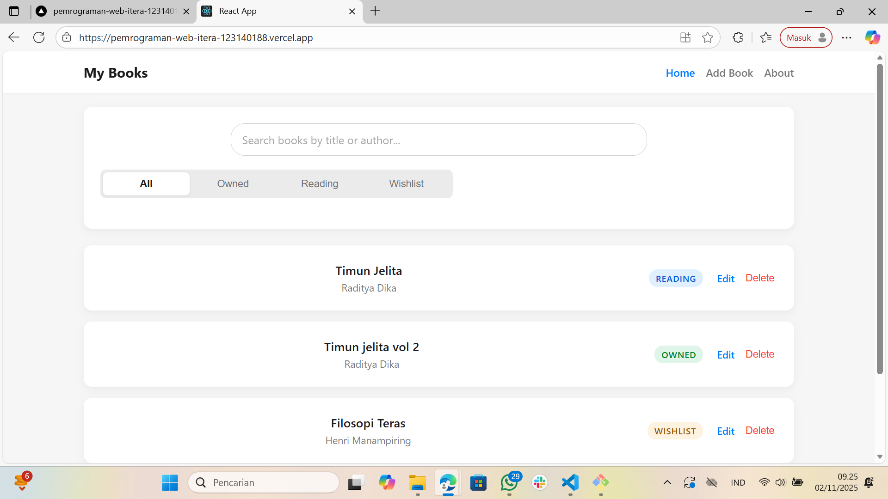
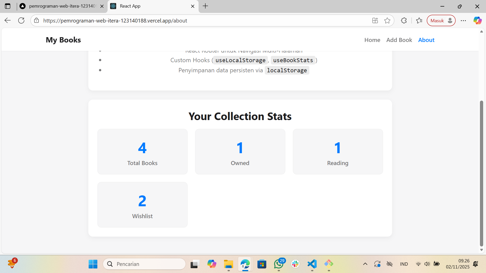

# Aplikasi Manajemen Buku Pribadi (Tugas Pertemuan 3)

Aplikasi web **manajemen buku pribadi** ini dibuat sebagai tugas untuk mata kuliah **Pengembangan aplikasi web** di **Institut Teknologi Sumatera**.

Dibangun menggunakan **React.js** dengan pemanfaatan fitur modern seperti:
- React Hooks
- Context API untuk *state management*
- React Router untuk navigasi

**Link Demo (Vercel):**  
[https://pemrograman-web-itera-123140188.vercel.app/](https://pemrograman-web-itera-123140188.vercel.app/)

---

## Tampilan Aplikasi

| Halaman Utama (Daftar Buku) | Halaman Tambah Buku |
|-----------------------------|---------------------|
|  |  |

| Halaman Statistik (About) |
|---------------------------|
|  |

| Hasil testing Unit |
|---------------------------|
|  |

---
